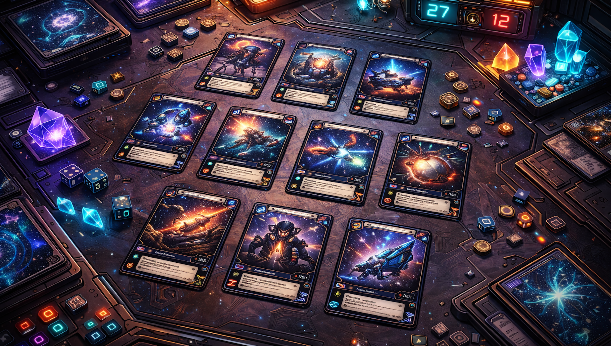

# 🔥 Card Forge Studio

> **Design. Build. Export. Dominate.**  
> Card Forge Studio is a blazing-fast, open-source tool for creating professional card game assets at scale.

Card Forge Studio is built for designers, developers, and worldbuilders who need **speed**, **power**, and **control**.  
Generating thousands of cards from data in seconds.

> *“In the land of bloated editors and slow pipelines, a mighty forge was built.”*

---

**Version:**2025.306.14
[Changelog](Changelog.md)

---

## ⚔️ What Is Card Forge Studio?

Card Forge Studio is a desktop tool for:

- Designing card layouts  
- Binding data to templates  
- Mass-generating card images  
- Exporting print-ready assets  

It’s built to handle *real* production workloads—no fluff, no bloat, no waiting.

---

## 🚀 Features

- **Ultra-Fast Rendering** – Generate hundreds or thousands of cards in moments  
- **Data-Driven** – CSV pipelines for bulk creation  
- **Template System** – Reusable, modular card layouts  
- **Image Export** – High-resolution, print-ready output  
- **Deterministic Builds** – Same input, same output, every time  
- **Open Source** – Free forever, hackable, yours  

---

<strong>📜 Version 0.01</strong>

### v0.01 — Genesis

#### Added
- Initial commit
- Core pipeline established  
- Data-driven generation online  
- Template system operational  
- High-speed image export working

---

## 🧠 Programming Required

Card Forge Studio is powerful because it **demands code**.

This is not a drag-and-drop toy. Card Forge Studio is built on a real engine, using:

- **AutoPlay Media Studio** – the host environment  
  https://www.indigorose.com/autoplay-media-studio/

- **Lua** – the scripting language that drives everything  
  https://www.lua.org/

- **LuaEx** – an extended standard library    
  https://github.com/CentauriSoldier/LuaEx

Layouts, pipelines, generation logic, data transforms—*you write them*.  
Every system is scriptable. Every behavior is deterministic. Every build is under your control.

That’s the trade:

- You bring logic.  
- Card Forge Studio gives you raw power.

If you can think in data and express it in code, Card Forge Studio becomes a weapon for mass creation—capable of generating entire games in seconds with precision and repeatability.

This is a forge for builders, not tourists.

---

## 🧰 Use Cases

- Tabletop & TCG designers  
- Board game prototyping  
- Procedural card generation  
- Rapid iteration on balance and layout  
- Print-on-demand pipelines  

If your workflow involves *lots of cards*, Card Forge Studio is your war machine.

---

## 🛠️ Philosophy

Card Forge Studio is built around three principles:

1. **Speed over ceremony**  
2. **Power over prettiness**  
3. **Creator control above all**

This is not a toy.  
It’s a forge.

---

## 📦 Status

Card Forge Studio is under active development.  
The goal is a lean, brutal toolchain that turns structured data into finished card art with zero friction.

---

## 🩸 License

Card Forge Studio is open-source, free to use, and licensed under **The Unlicense** wherever possible. AutoPlay Media Studio and AutoPlay Media Studio Plugins are licensed seperately and are property of their respective owners.
